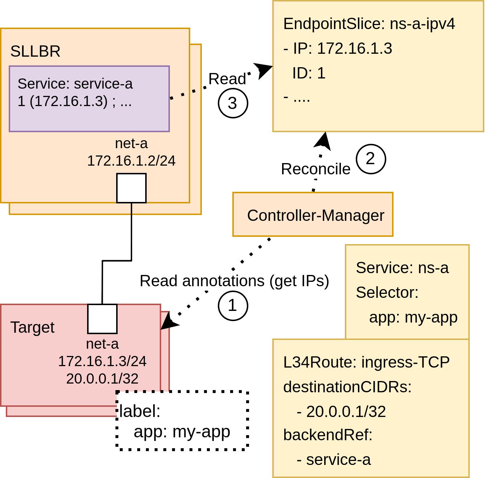
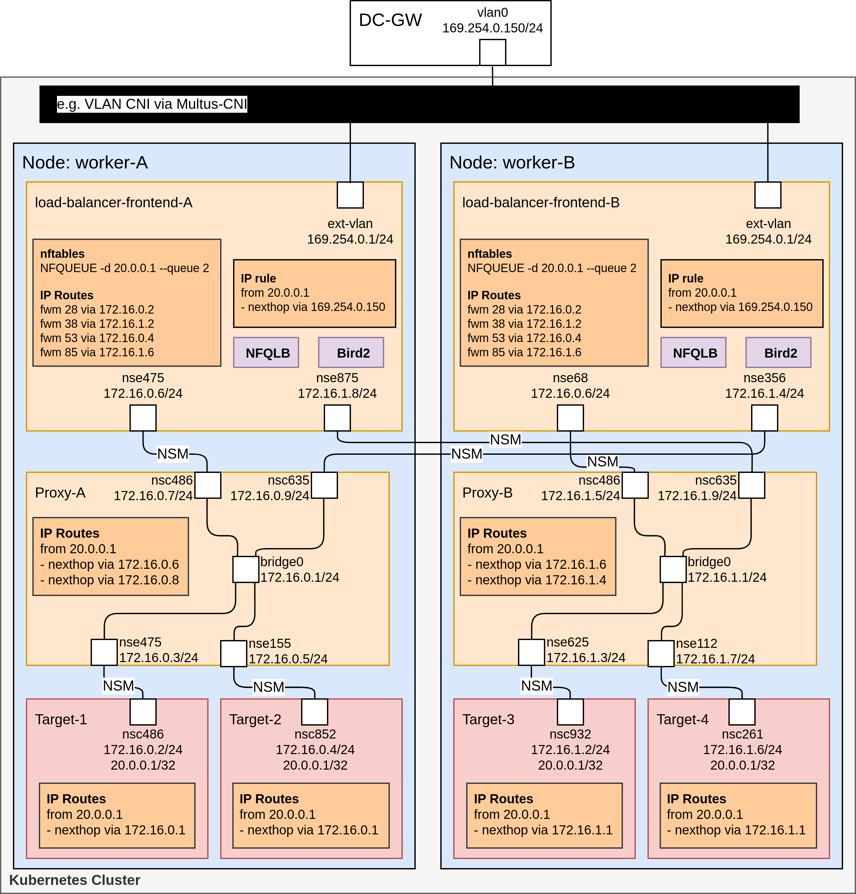
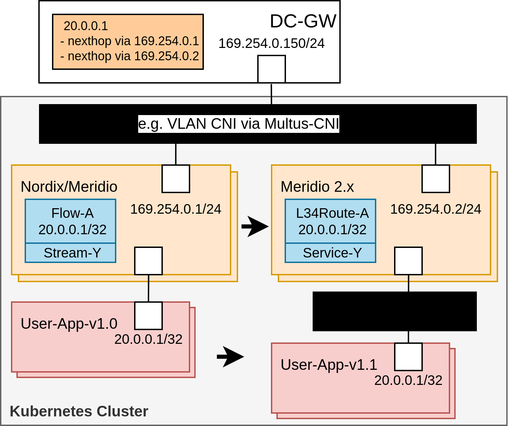

# Meridio 2.x

Meridio 2.x is an evolution of [Nordix/Meridio](https://github.com/nordix/meridio) built upon its foundation to offer a more modern and efficient approach. It enhances existing capabilities while introducing new features to better align with current technological trends and requirements.

As of today (January 2025), this project is in the Proof of Concept (PoC) phase with ongoing development and testing to validate its viability and performance before moving into a broader implementation.

An older implementation of this PoC is existing here: [LionelJouin/l-3-4-gateway-api-poc](https://github.com/LionelJouin/l-3-4-gateway-api-poc).

## Table of Contents

<!-- TOC start (generated with https://github.com/derlin/bitdowntoc) -->

- [Summary](#summary)
- [Motivation](#motivation)
   * [Why Meridio](#why-meridio)
- [API](#api)
   * [Gateway API and Kubernetes API](#gateway-api-and-kubernetes-api)
      + [Gateway](#gateway)
         - [GatewayClass](#gatewayclass)
      + [L34Route](#l34route)
      + [Service](#service)
   * [GatewayRouter](#gatewayrouter)
   * [API Nordix/Meridio Differences](#api-nordixmeridio-differences)
      + [Network Configuration and Endpoint Registration](#network-configuration-and-endpoint-registration)
- [Components](#components)
   * [Stateless-Load-Balancer-Router (SLLBR)](#stateless-load-balancer-router-sllbr)
      + [Stateless-Load-Balancer (SLLB)](#stateless-load-balancer-sllb)
      + [Router](#router)
   * [Controller-Manager](#controller-manager)
   * [Alternatives for Application Network Configuration Injection](#alternatives-for-application-network-configuration-injection)
      + [[1] Annotation Injection](#1-annotation-injection)
         - [[1.1] Dynamic Network Attachment](#11-dynamic-network-attachment)
         - [[1.2] Network Daemon](#12-network-daemon)
      + [[3] Sidecar](#3-sidecar)
      + [[4] Static Configuration](#4-static-configuration)
      + [Comparaison of the Alternatives for Application Network Configuration Injection](#comparaison-of-the-alternatives-for-application-network-configuration-injection)
   * [Components Nordix/Meridio Differences](#components-nordixmeridio-differences)
      + [Footprint](#footprint)
      + [Privileges](#privileges)
- [Data Plane](#data-plane)
   * [DC Gateway to Meridio Gateway](#dc-gateway-to-meridio-gateway)
   * [Stateless-Load-Balancer-Router (SLLBR)](#stateless-load-balancer-router-sllbr-1)
   * [Meridio Gateway to Endpoint (Application pod)](#meridio-gateway-to-endpoint-application-pod)
   * [Endpoint (Application pod)](#endpoint-application-pod)
   * [Dataplane Nordix/Meridio Differences](#dataplane-nordixmeridio-differences)
- [Extra Features](#extra-features)
   * [Gateway Configuration](#gateway-configuration)
   * [Resource Template](#resource-template)
   * [Port Address Translation (PAT)](#port-address-translation-pat)
- [Implementation Details](#implementation-details)
   * [Service Endpoint Identifier](#service-endpoint-identifier)
- [Prerequisites](#prerequisites)
   * [Prerequisites Nordix/Meridio Differences](#prerequisites-nordixmeridio-differences)
- [Multi-Tenancy](#multi-tenancy)
- [Upgrade and Migration](#upgrade-and-migration)
   * [Data Plane](#data-plane-1)
   * [Meridio 2.x](#meridio-2x)
   * [From Nordix/Meridio](#from-nordixmeridio)
- [Project Structure and Implementation](#project-structure-and-implementation)
   * [Projects](#projects)
   * [Framework amd Design Pattern](#framework-amd-design-pattern)
- [Evolution](#evolution)
   * [Dynamic Resource Allocation](#dynamic-resource-allocation)
   * [Non-Ready Pod Detection](#non-ready-pod-detection)
   * [Dynamic Network Interface Injection and Network Configuration Responsibility](#dynamic-network-interface-injection-and-network-configuration-responsibility)
   * [Service Type](#service-type)
   * [Service Chaining](#service-chaining)
   * [Service as BackendRefs](#service-as-backendrefs)
- [Alternatives](#alternatives)
   * [LoxiLB](#loxilb)
   * [OVN-Kubernetes](#ovn-kubernetes)
   * [F5](#f5)
   * [Google](#google)
   * [Cilium](#cilium)
- [References](#references)

## Summary

This document provides an overview of the architecture of the project focusing on its core components and how they work together to deliver their functionalities. It outlines the relationships between different elements within the system offering an understanding of their roles and interactions. This document also serves as a practical guide for deployment detailing the required infrastructure, dependencies and configuration steps needed to get the system up and running.

Beyond deployment, this document explores potential areas for growth and evolution considering how the architecture can adapt to new use cases, include new features, and integrate with emerging technologies. By anticipating future challenges and opportunities, the project aims to remain relevant and adaptable in an ever-changing cloud-native technological landscape.

Finally, this document provides an analysis of existing alternatives examining their strengths and weaknesses in comparison to the proposed solution. This comparison helps to highlight the unique advantages of the project and offers insights into how it differentiates itself from other approaches in the ecosystem.

## Motivation

The motivation behind this project is to evolve [Nordix/Meridio](https://github.com/nordix/meridio) and improve the overall system by utilizing industry standards such as, for example, Multus as the main secondary network provider. The design and implementation is streamlined focusing on reducing complexity while maintaining the core functionalities.

This evolution aims to simplify every aspect of the project starting with the user configuration by providing a more intuitive API, therefore making the system easier to use and configure. 

Key components are being pushed upstream to leverage community-driven improvements, such as [Kubernetes](https://github.com/kubernetes), the [Kubernetes Network Plumbing Working Group](https://github.com/k8snetworkplumbingwg), and [CNI](https://github.com/containernetworking). This reduces the need for custom solutions and ensures greater alignment with broader industry trends. 

Unnecessary components such as [Proxy](https://meridio.nordix.org/docs/components/proxy), [IPAM](https://meridio.nordix.org/docs/components/ipam) and [TAPA](https://meridio.nordix.org/docs/components/tapa) that were previously under the responsibilities of [Nordix/Meridio](https://github.com/nordix/meridio) are removed allowing a more focused and efficient system. Reducing the number of components within the system also minimizes potential points of failure and simplifies maintenance and troubleshooting.

Deprecated and unsuitable components, such as Network Service Mesh, are phased out to make a way towards more modern solutions. This will be causing unused dependencies to be also eliminated (e.g. Spire and Open Telemetry), freeing the project from unnecessary bloat.

The evolution also enables an enhanced networking control giving users more flexibility and customization options, thus allowing the project to be deployed on a wider range of PaaS platforms, increasing its versatility and accessibility.

### Why Meridio

Meridio is an open-source project designed to address the unique networking challenges faced by telecommunications Cloud-Native Functions (CNFs). It meets the growing need for advanced and specialized traffic distribution within cloud-native environments by offering a solution that ensures isolation, scalability, and flexibility.

One of the key strengths is its support for secondary networking which enhances security, performance, and fault tolerance. By isolating traffic, it prevents failures in one network segment from affecting others, a critical feature for telecommunications and enterprise environments where uptime and security are essential.

By leveraging routing protocols such as BGP and BFD, Meridio has the ability to attract external traffic efficiently. This ensures reliable service advertisement and link supervision, allowing traffic to be distributed effectively across different network services.

The architecture of Meridio also enables the development of specialized network services. Notably, it includes a stateless and NATless load balancer optimized for TCP, UDP, and SCTP traffic. This load balancer provides traffic classification steering traffic into multiple different network services. The stateless nature of the load balancer offers advantages such as horizontal scalability without relying on shared state information, reducing latency, and simplifying management, deployment, monitoring, and troubleshooting.

In summary, Meridio offers a comprehensive and flexible solution for modern cloud-native networking. Its focus on secondary networking, efficient external traffic attraction, and the development of specialized network services makes it an ideal choice for organizations looking to optimize their network infrastructure, particularly in telecommunications and advanced enterprise environments.

## API

### Gateway API and Kubernetes API

The project aims to leverage standard Kubernetes APIs as much as possible and focuses on providing implementations that seamlessly integrate with existing workflows. By adopting [Gateway API](https://github.com/kubernetes-sigs/gateway-api), the project aligns with Kubernetes-native networking paradigms, ensuring compatibility with upstream developments and reducing the need for custom solutions.

#### Gateway

The `Gateway` object represents an instance of a service-traffic handling infrastructure. This API object has been officially released as version 1 (v1). More can be read about it on the official documentation: [gateway-api.sigs.k8s.io/concepts/api-overview/#gateway](https://gateway-api.sigs.k8s.io/concepts/api-overview/#gateway).

```yaml
apiVersion: gateway.networking.k8s.io/v1beta1
kind: Gateway
metadata:
  name: sllb-a
spec:
  gatewayClassName: meridio-experiment/stateless-load-balancer
  listeners: # This is to be ignored
  - name: all
    port: 4000
    protocol: TCP
  infrastructure:
    annotations: 
      k8s.v1.cni.cncf.io/networks: '[{"name":"vlan-100","interface":"vlan-100"},{"name":"macvlan-nad-1","interface":"net1"}]' # Networks attached to the gateway workloads
      meridio-experiment/networks: '[{"name":"macvlan-nad-1","interface":"net1"}]' # Networks towards the service selected pods
      meridio-experiment/network-subnets: '["169.111.100.0/24"]'
```

Here is an example above of how a `Gateway` would look like. Once deployed, the operator/controller will be in charge of deploying the component for the gateway to provide the functionalities described by the GatewayClass `meridio-experiment/stateless-load-balancer`. 

The `.spec.infrastructure` field represents some configuration specific to the workload being deployed. The `k8s.v1.cni.cncf.io/networks` are added to the `Gateway` workloads, so pods (SLLBRs) will be attached to these networks via Multus when they are deployed. 

`meridio-experiment/networks` indicates the network(s) the application pods must be attached to if they want to be considered as an endpoint behind the `Services` (service being handled by the `Gateway`). `meridio-experiment/network-subnets` indicates in which subnet(s) the endpoint IP(s) are. In this example, the endpoints (application pods behind the service) must have the network interface provided by Multus via `macvlan-nad-1` and the endpoint IPs for these pods will be all IPs in the subnet `169.111.100.0/24` for the network interface (provided via `macvlan-nad-1`). 

These 2 configurations, `meridio-experiment/networks` and `meridio-experiment/network-subnets`, exposed as annotation here, can be seen as default value for all `Services`. In the future, these could also be exposed at `Service` level, allowing each `Service` to specify the network(s) on which the traffic will flow to reach the target.

For more control, if required in the future, another sub-field named `parametersRef` allows passing a configuration object.

The `.spec.listeners` field is not relevant for the functionalities provided by this project and must be ignored. Gateway API enforces to have at least one item, so a random one must be set. An option which could make it relevant to this project has mentioned it these conversations: [kubernetes-sigs/gateway-api#130](https://github.com/kubernetes-sigs/gateway-api/pull/130), [kubernetes-sigs/gateway-api#780](https://github.com/kubernetes-sigs/gateway-api/pull/780#discussion_r693210917), [kubernetes-sigs/gateway-api#818](https://github.com/kubernetes-sigs/gateway-api/issues/818) and [kubernetes-sigs/gateway-api#1061](https://github.com/kubernetes-sigs/gateway-api/issues/1061).

Once deployed, the `.status.Conditions` field will be set indicating the status of the `Gateway` (Ready if deployed successfully, and NotReady if not).

The keys of the annotations in the `.spec.infrastructure` field are likely to change, but the concepts and functionalities will remain the same.

##### GatewayClass

The `GatewayClass` represents the type of `Gateway` which can be deployed in the cluster. The existence of this object is not enforced by Gateway API. More can be read about it on the official documentation: [gateway-api.sigs.k8s.io/concepts/api-overview/#gatewayclass](https://gateway-api.sigs.k8s.io/concepts/api-overview/#gatewayclass).

```yaml
---
kind: GatewayClass
apiVersion: gateway.networking.k8s.io/v1
metadata:
  name: meridio-experiment/stateless-load-balancer
spec:
  controllerName: meridio-experiment/stateless-load-balancer
  description: "Telco stateless Load-Balancer handling L34Routes and Services."
```

Here is an example of how this `GatewayClass` could look like. In the PoCs, this object is not used.

#### L34Route

The `L34Route` provides a mechanism to route Layer 3 and Layer 4 traffic to a designated backend, typically represented as a Kubernetes `Service`. It enables precise traffic steering based on IP address and transport-layer attributes ensuring that packets matching specified criteria are forwarded to the appropriate destination.

The `.spec.parentRefs` field within an L34Route resource specifies the `Gateway` in which the route will be configured. Once the route is established within a `Gateway`, the `.spec.destinationCIDRs` defined in the configuration are reflected in the `.status.Addresses` field of the `Gateway`. This status update indicates that the `Gateway` is actively handling traffic for the specified addresses.

To maintain a clear routing setup, `L34Route` enforces certain constraints: each route can reference only a single `.spec.parentRefs` and a single `.spec.backendRefs` ensuring a straightforward and predictable traffic flow. Additionally, only `/32` CIDRs for IPv4 and `/128` CIDRs for IPv6 are supported in the `.spec.destinationCIDRs` field.

Additionally, multiple `L34Route` resources can be configured within the same `Gateway` and multiple `L34Route` can reference the same `.spec.backendRefs`. In such cases, the `L34Route` with the highest `.spec.priority` value is prioritized.

```yaml
apiVersion: meridio.experiment.gateway.api.poc/v1alpha1
kind: L34Route
metadata:
  name: vip-20-0-0-1-multi-ports-a
spec:
  parentRefs:
  - name: sllb-a
  backendRefs:
  - name: service-a
    port: 1 # This must be set but is being ignored.
  priority: 10
  destinationCIDRs:
  - 20.0.0.1/32
  sourceCIDRs:
  - 0.0.0.0/0
  sourcePorts:
  - 0-65535
  destinationPorts:
  - "4000"
  - "4001"
  protocols:
  - TCP
```

In the above example, the L34Route is configured in the `Gateway` called `sllb-a`. The TCP IPv4 traffic with any source IP (`0.0.0.0/0`), any source port (port range `0-65535`), a destination IP `20.0.0.1` (`20.0.0.1/32`) and a port `4000` or `4001` will be steered towards the backend `service-a`.

In addition to what has been shwon in the example, the `byteMatches` field matching bytes in the L4 header is also available.

This API is not part of Gateway API but discussions are happening within the community about it here: [User reports for TCPRoute and UDPRoute (kubernetes-sigs/gateway-api/discussions#3475)](https://github.com/kubernetes-sigs/gateway-api/discussions/3475#discussioncomment-11522199) and [Layer 3 / load balancer / Service route (kubernetes-sigs/gateway-api/discussions#3351)](https://github.com/kubernetes-sigs/gateway-api/discussions/3351#discussioncomment-11522379).

The names of the attributes are likely to change in this API, but the concepts and functionalities will remain the same.

#### Service

In the context of this project, the `Service` object from the Kubernetes Core API is used as a headless Service, which means the Service is configured without a cluster IP. This configuration allows the system to bypass the default Kubernetes load balancing and instead rely on a custom load-balancer.

The `Service` specifies in which `Gateway` it must be running via the well-known `Service` label `service.kubernetes.io/service-proxy-name`, thus preventing a `Service` to be running in several `Gateway`. The endpoints of the `Service` are selected via the `.spec.selector` field.

```yaml
apiVersion: v1
kind: Service
metadata:
  name: service-a
  labels:
    service.kubernetes.io/service-proxy-name: sllb-a
spec:
  clusterIP: None
  selector:
    app: example-target-application-multi
    meridio-experiment/dummy-service-selector: "true"
```

In the example above, the `Service` is set to be configured by and running in the `Gateway` named `sllb-a`. The `Service` will load-balance the traffic it will receive to the endpoints (pods) with the label `app=example-target-application-multi`. 

The label `meridio-experiment/dummy-service-selector=true` is ignored by the implementation. The reason to have the label is to disable the main Kubernetes EndpointSlice Controller which selects the primary pod IPs. The [KEP 4770 (EndpointSlice Controller Flexibility)](https://github.com/kubernetes/enhancements/issues/4770) is proposing a solution to avoid this situation and provide a native Kubernetes feature.

Discussions are currently happening in the Gateway API community towards an alternative to `Service` as a backend. The [GEP-3539](https://github.com/kubernetes-sigs/gateway-api/issues/3539) is about a new object named `EndpointSelector` which would provide a similar `selector` field as the `Service` with more possibility to extend it for modern solutions.

### GatewayRouter

The `GatewayRouter` defines how to establish connectivity with an external DC-Gateway such as, which IP-address, routing- and supervision-protocol(s) to use. The `GatewayRouter` can also define specific protocol settings that differ from the default.

The `Gateway` in which the `GatewayRouter` is being configured in is specified via the label `service.kubernetes.io/service-proxy-name`.

Except the `.spec.interface` and the label, this `GatewayRouter` object is similar to the `Gateway` object in Nordix/Meridio.

```yaml
apiVersion: meridio.experiment.gateway.api.poc/v1alpha1
kind: GatewayRouter
metadata:
  name: gateway-a-v4
  labels:
    service.kubernetes.io/service-proxy-name: sllb-a
spec:
  address: 169.254.100.150
  interface: vlan-100
  bgp:
    localASN: 8103
    remoteASN: 4248829953
    holdTime: 24s
    localPort: 10179
    remotePort: 10179
    bfd:
      switch: true
      minTx: 300ms
      minRx: 300ms
      multiplier: 5
```

### API Nordix/Meridio Differences

Here below, a table summarizing the API differences:

| Nordix/Meridio | Meridio 2.x | Description |
| ------- | ------- | ------- |
| [Trench](https://meridio.nordix.org/docs/concepts/trench) | N/A |  |
| [VIP](https://meridio.nordix.org/docs/concepts/vip) | N/A (1.) |  |
| [Gateway](https://meridio.nordix.org/docs/concepts/gateway) | GatewayRouter | Connects to the external Router/DC-Gateway and advertises VIPs |
| [Attractor](https://meridio.nordix.org/docs/concepts/attractor) | Gateway | Workload handling traffic where the `L34Routes` and `Services` are running |
| [Conduit](https://meridio.nordix.org/docs/concepts/conduit) | N/A |  |
| [Stream](https://meridio.nordix.org/docs/concepts/stream) | Service | Load-Balances traffic among endpoints (application pods) |
| [Flow](https://meridio.nordix.org/docs/concepts/flow) | L34Route | Classifies traffic to a `Service` |

1. **VIPs** are now defined by the users in the `.spec.destinationCIDRs` field of the `L34Routes`.

Here below, a traffic flow diagram of Nordix/Meridio:


Here below, a traffic flow diagram of Meridio 2.x:


#### Network Configuration and Endpoint Registration

A major difference between Nordix/Meridio and Meridio 2.x is the way networks are configured and how endpoints are registered to services.

In Nordix/Meridio, network configuration and endpoint registration were tightly coupled with Network Service Mesh (NSM). A sidecar container named TAPA (Target Access Point Ambassador) was responsible for managing these tasks. Using a custom TAP (Target Access Point) API, users requested TAPA, which in turn requested connectivity with the network service via NSM. The network interface was then configured automatically within the application pod. Once the network was configured in the pod, TAPA registered the pod as an endpoint via the NSP (Network Service Platform) API, allowing the pod to start receiving traffic. This process was opaque to the user, as the internal network configuration and the endpoints registered were not exposed via the Nordix/Meridio API nor the Kubernetes API.

Meridio 2.x introduces a more user-centric and flexible approach to network configuration and endpoint registration. Users are now responsible for providing and configuring the network(s) for their application pods. Endpoint registration is driven by Kubernetes labels. Users select the pods that will serve as endpoints behind a service using label selectors. Once selected, the pods receive additional network configurations (VIPs and SBRs, still being configured by Meridio 2.x depending on the implementation) and start receiving traffic. This approach simplifies endpoint management and leverages Kubernetes-native mechanisms for service discovery and load balancing.

While the Nordix/Meridio approach simplified network management by automating configurations, it lacked flexibility and transparency. Users had limited control over the network configurations, and the tight coupling with NSM made it difficult to integrate with other network solutions. The approach taken by Meridio 2.x offers several benefits. By decoupling network management from the infrastructure, it gives more control and transparency to the users and supports a wide range of network configurations, accommodating different user needs and requirements. The use of Kubernetes-native mechanisms for endpoint registration also simplifies integration with other network solutions and reduces dependencies on specific frameworks and APIs.

Below is a comparison of the endpoint registration in Nordix/Meridio and Meridio 2.x:

| Nordix/Merdio | Meridio 2.x |
| ------- | ------- |
|  |  |

## Components

### Stateless-Load-Balancer-Router (SLLBR)

The Stateless-Load-Balancer-Router (SLLBR) is the workload (`Deployment`) instance(s) behind a `Gateway` object handling service-traffic. It is designed to provide high-performance packet forwarding without maintaining connection state, ensuring scalability and resilience.

SLLBR is composed of two containers:
* `Stateless-Load-Balancer`: Responsible for distributing incoming traffic across backend pods based on defined `L34Routes` and `Services` handle by the `Gateway`.
* `Router`: Responsible for advertising VIPs handled by the `Gateway` to `GatewayRouters`.

To function correctly, SLLBR requires specific system settings (SYSCTLs) to be configured within the pod's network namespace. These settings include:
* `forwarding` set to `1` to enable IP forwarding.
* `fib_multipath_hash_policy` set to `1` to allow multipath routing based on layer 4 hash.
* `rp_filter` set to `2` to allow packets to have a source address which does not correspond to any routing destination address.
* `fwmark_reflect` set to `1` to allow generated outbound ICMP `fragmentation needed` reply to use VIP as source address.
* `ip_local_port_range` set to `49152 65535` to define the range of ephemeral ports available for outgoing connections to fulfill the BFD Control packet requirements.

#### Stateless-Load-Balancer (SLLB)

The Stateless-Load-Balancer container is responsible for running the load-balancer process based on [Nordix/nfqueue-loadbalancer](https://github.com/Nordix/nfqueue-loadbalancer) (NFQLB). This component efficiently distributes incoming traffic to backend pods without maintaining session state, ensuring high performance and scalability. 

The container continuously watches relevant Kubernetes objects such as `Gateway`, `L34Route`, `Service` and `EndpointSlices` to dynamically configure NFQLB (nfqueue-loadbalancer), nftables and routes ensuring that changes in the cluster are reflected in the load-balancer configuration in real time. 

The readiness of the container is determined by two key factors: the successful execution of the NFQLB (nfqueue-loadbalancer) process and the ability to communicate with the Kubernetes API. This ensures that the load-balancer is fully operational and integrated within the cluster.

To function properly, the container requires specific Linux capabilities and Kubernetes API access, including:
* `NET_ADMIN` to configure network settings such as routing and firewall rules.
* `IPC_LOCK` to allow NFQLB to use shared memory.
* `IPC_OWNER` to allow NFQLB to use shared memory.
* `Kubernetes API`: `watch`, `list` and `get` the `Gateway`, `L34Route`, `Service` and `EndpointSlices` objects.

#### Router

The Router container is responsible for running the routing suite Bird2 and advertising the VIPs handled by the `Gateway` to the DC-Gateway.

The container continuously watches relevant Kubernetes objects such as `Gateway` and `GatewayRouter` to ensure that changes in the cluster are reflected in the Bird2 configuration in real time. 

The controller-manager aggregating all VIPs handled by the `Gateway` into the `.status.Addresses`, the router watches these VIPs in order to advertise them to the `GatewayRouters` handled by the router.


The readiness of the container is determined by its ability to successfully run Bird2 and establish communication with the Kubernetes API.

To function properly, the container requires specific Linux capabilities and Kubernetes API access, including:
* `NET_ADMIN` to manage and modify routing tables.
* `NET_BIND_SERVICE` to allow Bird2 to bind to privileged ports.
* `NET_RAW` to Bird2 BIRD to use the SO_BINDTODEVICE socket option.
* `Kubernetes API`: `watch`, `list` and `get` the `Gateway` and `GatewayRouter` objects.

### Controller-Manager

The Controller-Manager (Operator) is responsible for reconciling and managing Kubernetes objects that belong to the appropriate `GatewayClass`, ensuring that the correct resources are deployed and maintained according to the specified configuration.

A key function of the Controller Manager is to reconcile and manage `Gateway` objects to deploy and maintain the Stateless-Load-Balancer-Router (SLLBR) component based on the `Gateway` specs.


Additionally, the Controller Manager handles the reconciliation of `EndpointSlice` objects which consist in maintaining endpoint information (IP and Status) for the pods selected by the `Services` managed by the associated `Gateways`. This ensures that traffic is correctly routed to the appropriate backend instances maintaining service availability and performance.

The [KEP 4770 (EndpointSlice Controller Flexibility)](https://github.com/kubernetes/enhancements/issues/4770) was proposing a solution to transform the Kubernetes EndpointSlice Controller as a generic one capable of selecting secondary IPs. Since it got rejected, the alternative ([sig-network meeting notes from 2025-01-16](https://docs.google.com/document/d/1_w77-zG_Xj0zYvEMfQZTQ-wPP4kXkpGD8smVtW_qqWM/edit?tab=t.0)) is to implement it as a separated repository under `kubernetes-sigs` so it can be re-used for this use-case.

The readiness of the container is determined by its ability to successfully establish communication with the Kubernetes API.

To perform these operations, the Controller Manager requires access to a set of Kubernetes API resources:
* `Pod`: `watch`, `list` and `get`.
* `Deployment`: `create`, `delete`, `get`, `list`, `patch`, `update` and `watch`.
* `Gateway`: `watch`, `list` and `get`.
* `Gateway/status`: `patch` and `update`.
* `Service`: `watch`, `list` and `get`.
* `EndpointSlice`: `create`, `delete`, `get`, `list`, `patch`, `update` and `watch`.
* `L34Route`: `watch`, `list` and `get`.

### Alternatives for Application Network Configuration Injection

Injecting VIPs and source-based routes into the application is essential to ensure correct network behavior. More details about this process are provided in the dataplane section.

Source-based routes need to be dynamically aligned with the SLLBR instances, ensuring that when SLLBRs are scaled, traffic continues to be routed to the appropriate destinations without disruption. This alignment is crucial to maintain seamless connectivity and load distribution across the infrastructure.

Similarly, VIPs must correspond to those served by the `Gateway`. While not an immediate requirement, VIPs can be added, updated and removed at the same time as the SBRs maintaining consistency with the `Gateway`. Since it is not an immediate requirement, application pods can be recreated when new VIPs are introduced. The responsibilities to add those VIPs can also be delegated on the user side.

There are multiple ways to address this challenge, each offering different levels of automation, flexibility, and complexity. More solutions could also be imagined such as direct server return (DSR) to solve this challenge.

#### [1] Annotation Injection

In this solution, source-based routes and VIPs required by the application are exposed through pod annotations. These annotations represent the desired state and provide visibility into the intended network configuration. This approach allows another component to detect these annotations and inject the necessary configuration directly into the pod ensuring the pod network configuration is adjusted accordingly based on this desired state. 


Different implementation approaches can be considered to achieve annotation-based injection, each with its own trade-offs. Two primary methods are highlighted: one that places the responsibility on the infrastructure, ensuring that network configurations are applied automatically with minimal privileges at the pod level, and another that requires more privileges within the pod itself, offering greater flexibility but increasing security considerations.

##### [1.1] Dynamic Network Attachment

To inject VIP and SBRs in the pod based on its annotations, this solution leverages Multus-Thick and [Multus-Dynamic-Networks-Controller](https://github.com/k8snetworkplumbingwg/multus-dynamic-networks-controller), which provide the capability to add and reconcile annotations while a pod is running. This allows for dynamic network configuration changes without requiring pod restarts.


The approach relies on the [Macvlan](https://www.cni.dev/plugins/current/main/macvlan/) and the [Source-Based Routing (SBR)](https://www.cni.dev/plugins/current/meta/sbr/) CNI plugins. An additional attachment is configured using Macvlan on top of the secondary network interface to handle VIP addresses and source-based routing.

Here is an example below of how the behavior will be when adding a new VIP and when scaling down the SLLBRs.

| Phase 1 | Phase 2 | Phase 3 |
| ------- | ------- | ------- |
|  |  |  |

 In phase 1, the system operates with its current configuration, handling traffic as expected. During phase 2, a new network attachment is introduced to accommodate updated requirements, such as adding a new VIP (`40.0.0.1/32`) and modifying source-based routes to reflect the upcoming removal of SLLR-2. Although both configurations temporarily coexist, they are designed to avoid conflicts (Note: the table ID of the new SBR is different than the old one). In phase 3, the outdated configuration is removed, achieving the network update without traffic disruption. The only noticeable change is the source MAC address in response packets which will now reflect the newly added macvlan interface.

Here is an example below of a CNI config used to config the VIPs and SBRs on the secondary network interface in an application pod:
```json
{
    "cniVersion": "1.0.0",
    "name": "sbr-vip-pod-a",
    "plugins": [
        {
            "type": "macvlan",
            "master": "net1", // secondary interface in the application pod
            "linkInContainer": true,
            "ipam": {
                "type": "static",
                "addresses": [
                    {
                        "address": "20.0.0.1/32", // VIP
                    },
                ],
                "routes": [
                    { 
                        "dst": "20.0.0.1/32",
                        "table": 5000,
                        "scope": 253, // link
                    },
                    { 
                        "dst": "0.0.0.0/0",
                        "gw": "172.16.0.1", // SLLBR IP
                        "table": 5000,
                    },
                ],
            }
        },
        {
            "type": "tuning",
            "sysctl": {
                "net.ipv4.conf.IFNAME.arp_ignore": "8"
            }
        },
        {
            "type": "sbr",
            "table": 5000
        }
    ]
}
```

In this scenario, managing `NetworkAttachmentDefinition` objects can be complex, requiring careful handling to avoid issues such as stale configurations and resource leakage. Proper coordination and orchestration is essential to prevent conflicts, such as collisions in table IDs, and to ensure seamless updates in response to network changes.

Another potential challenge with this solution is that upon Meridio 2.x uninstallation, network configurations may remain on the application pod. However, they can be easily removed by clearing the corresponding pod annotations.

Such solution which relies on adding and removing `NetworkAttachmentDefinition` with MACVLAN CNI alongside the SBR CNI is necessary because CNI does not have any concept of update. Only `ADD` and `DEL` operations are available in CNI, therefore Multus and the Multus-Dynamic-Networks-Controller can only add and del `NetworkAttachmentDefinition` on a pod. Relying on MACVLAN on top of the secondary network interface is a solution to add and remove VIPs and SBRs without any interference with the secondary network interface and with the previously configured VIPs and SBRs.

Adopting this approach also implies that other secondary network providers must support dynamic network attachment, which would require additional development effort for each supported solution.

To perform these operations, a new controller requires access to a set of Kubernetes API resources:
* `Pod`: `patch`, `update` , `watch`, `list` and `get`.

This approach has been demonstrated in the proof-of-concept available here: [LionelJouin/l-3-4-gateway-api-poc](https://github.com/LionelJouin/l-3-4-gateway-api-poc).

##### [1.2] Network Daemon

In this solution, a DaemonSet is deployed to manage the pod network configuration by reading the pod annotations. The daemon accesses the network namespace of the pod and removes any outdated network configurations and applies new ones based on the annotations of the pod (expected state).

The DaemonSet is deployed alongside Meridio 2.x so it can access the network namespace of the pods across the entire cluster.

Status information about the network configuration is captured and reported within pod annotations by the network daemon. This ensures that the previously applied configurations can be retrieved and referenced if the expected state needs to be updated, re-applied or removed. This approach also provides visibility into the system's configuration over time.

To function properly, the container requires specific host directories mounted, Linux capabilities, CRI API and Kubernetes API access, including:
* `/run/netns/` mounted to access the network namspace of the pods.
* `/run/containerd/containerd.sock` mounted to access the CRI API.
* `SYS_ADMIN` to access the network namspace of the pods.
* `NET_ADMIN` to configure network settings such as routing and IP addresses.
* `Kubernetes API`:`patch`, `update` , `watch`, `list` and `get` the `Pod` object.
* `Kubernetes API`: `watch`, `list` and `get` the `Gateway`, `L34Route` and `Service` objects.

During uninstallation, residual configurations could be left on the application pod. A job running on each node can be used to clean up any leftover network configurations, ensuring the system is fully cleaned after Meridio 2.x is removed.

This solution is demonstrated in the proof of concept at: [LionelJouin/meridio-2.x](https://github.com/LionelJouin/meridio-2.x).

#### [3] Sidecar

In this solution, a container with specific privileges is running as a sidecar within the application pod to configure source-based routes and VIPs tailored to the services the pod is serving. This sidecar ensures that the networking configuration is dynamically adjusted. 

To perform these operations, the sidecar requires access to a set of Kubernetes API resources (to be defined) and requires the `NET_ADMIN` capability to manage and modify routing tables and IPs.

The sidecar concept was demonstrated in the early phase of Nordix/Meridio: [v0.1.0-alpha](https://github.com/Nordix/Meridio/tree/v0.1.0-alpha)

#### [4] Static Configuration

In this scenario, the user must reserve dedicated internal IPs for allocation to the SLLBRs. Additional configuration is also required on the user side to pre-configure the VIPs and source-based routes towards these dedicated internal IPs. These dedicated internal IPs will be picked by the SLLBRs and configured on their own network interface by themselves.

To ensure proper allocation, the SLLBRs need to sync their states to prevent IP conflicts, ensuring that no IP is assigned to more than one SLLBR. This coordination is vital for maintaining network integrity.

Here is an example below on the behavior when scaling down the SLLBRs:

| Phase 1 | Phase 2 |
| ------- | ------- |
|  |  |

In phase 1, SLLBR-1 is assigned the IP `169.2.1.251` and SLLBR-2 is assigned `169.2.1.252`, so the outgoing traffic from the application pod is being routed only between these two pods. In phase 2, when the SLLBRs are scaled down, `169.2.1.251` is released and reassigned to SLLBR-3. 

This has not been demonstrated, there may be issues when scaling SLLBRs in the application pod due to neighbor table cache, potentially causing disruptions in traffic routing.

#### Comparaison of the Alternatives for Application Network Configuration Injection

Here is below a table compairing the different alternatives.

| Option | Multus Dependent | Development Complexity | Ease of Use | Privileges | Troubleshooting | PoC | Footprint |
| ------- | ------- | ------- | ------- | ------- | ------- | ------- | ------- |
| [1.1] Dynamic Network Attachment | Yes | Complex | Easy | Minimal | Complex | Yes | Moderate |
| [1.2] Network Daemon | No | Easy / Moderate | Easy | Important | Easy / Moderate | Yes | Moderate |
| [3] Sidecar | No | Easy / Moderate | Moderate | Moderate | Moderate | Yes | Moderate / High |
| [4] Static Configuration | No | Complex | Complex | Minimal | Complex | No | Minimal |

* **Multus Dependent**: Does the option depend on Multus?
* **Development Complexity**: How complex is the option to implement / develop?
* **Ease of Use**: From the user perspective, how easy to use the option is?
* **Privileges**: How much privileges are required to implement the option?
* **Troubleshooting**: How easy is it to troubleshoot a potential issue?
* **PoC**: Has this option been demonstrated via a PoC?
* **Footprint**: Does the option consume a lot of resources?

### Components Nordix/Meridio Differences

Below is a comparison of the communication between components in Nordix/Meridio and Meridio 2.x:

| Nordix/Merdio | Meridio 2.x |
| ------- | ------- |
|  |  |

Below is a comparison of the configuration management in Nordix/Meridio and Meridio 2.x:

| Nordix/Merdio | Meridio 2.x |
| ------- | ------- |
|  |  |

#### Footprint

Resource consumption for pods running on Nordix/Meridio and Meridio 2.x has been measured under idle conditions (no traffic). To ensure a fair comparison, the configuration and environment were replicated as closely as possible across both setups:
* Cluster Setup: 3 nodes (1 control plane, 2 worker nodes), 1 external DC-Gateway
* Workload: 4 application pods, 2 load-balancer instances

Below is a table of the footprint of the Nordix/Meridio (v1.1.6 and NSM v1.13.2) components:

| Component | Prerequisite | CPU | Memory | Comment |
| ------- | ------- | ------- | ------- | ------- |
| Operator | No | 1m | 16Mi |  |
| Stateless-LB-Frontend (stateless-lb) | No | 4m | 23Mi |  |
| Stateless-LB-Frontend (frontend) | No | 8m | 12Mi |  |
| Proxy | No | 5m | 13Mi | This component is a Daemonset |
| TAPA | No | 3m | 9Mi | This component is a sidecar container running on application pods |
| NSP | No | 5m | 17Mi |  |
| IPAM | No | 5m | 10Mi |  |
| nsmgr | Yes | 16m | 50Mi | This component is a Daemonset |
| nsm-forwarder-vpp | Yes | 69m | 330Mi | This component is a Daemonset |
| nsm-registry | Yes | 10m | 34Mi |  |
| spire-agent | Yes | 6m | 29Mi | This component is a Daemonset |
| spire-server (server) | Yes | 4m | 25Mi |  |
| spire-server (controller-manager) | Yes | 3m | 18Mi |  |
| Multus | Yes | 1m | 19Mi | This component is a Daemonset |

Below is a table of the footprint of the Meridio 2.x components:

| Component | Prerequisite | CPU | Memory | Comment |
| ------- | ------- | ------- | ------- | ------- |
| Controller-Manager | No | 1m | 16Mi |  |
| SLLBR (SLLB) | No | 1m | 16Mi |  |
| SLLBR (Router) | No | 2m | 9Mi |  |
| Network Daemon | No | 1m | 10Mi | This component is a Daemonset |
| Multus | Yes | 1m | 19Mi | This component is a Daemonset |

#### Privileges

Below is a table of the privileges required for Nordix/Meridio (v1.1.6 and NSM v1.13.2) components:

| Component | Kubernetes API | `Privileged: true` | Capabilities | Sysctl | Host Access | Comment |
| ------- | ------- | ------- | ------- | ------- | ------- | ------- |
| Operator | Yes | No | No | No | `hostPath` (Spire) | |
| Stateless-LB-Frontend | No | No | Yes (`NET_ADMIN`, `IPC_LOCK`, `IPC_OWNER`) | Yes (`forwarding`, `fib_multipath_hash_policy`, `rp_filter`, `fwmark_reflect`) | `hostPath` (NSM, Spire) | |
| Proxy | No | No | Yes (`NET_ADMIN`) | Yes (`forwarding`, `accept_dad`, `fib_multipath_hash_policy`, `rp_filter`) | `hostPath` (NSM, Spire) | This component is a Daemonset |
| TAPA | No | No | No | No | `hostPath` (NSM, Spire) | This component is a sidecar container running on application pods |
| NSP | Yes | No | No | No | `hostPath` (Spire) |  |
| IPAM | No | No | No | No | `hostPath` (Spire) |  |
| nsmgr | Yes | No | No | No | `hostPath` (NSM, Spire) | This component is a Daemonset |
| nsm-forwarder-vpp | No | Yes | N/A | No | `hostNetwork`, `hostPID`, `hostPath` (NSM, Spire, Kubelet, `/sys/fs/cgroup`, `/dev/vfio`) | This component is a Daemonset |
| nsm-registry | Yes | No | No | No | `hostPath` (NSM, Spire) |  |
| spire-agent | Yes | No | No | No | `hostPath` (Spire) | This component is a Daemonset |
| spire-server | Yes | No | No | No | `hostPath` (Spire) |  |
| Multus | Yes | Yes | N/A | No | `hostPath` (`/etc/cni/net.d`, `/opt/cni/bin`) | This component is a Daemonset |

Below is a table of the privileges for Meridio 2.x components:

| Component | Kubernetes API | `Privileged: true` | Capabilities | Sysctl | Host Access | Comment |
| ------- | ------- | ------- | ------- | ------- | ------- | ------- |
| Controller-Manager | Yes | No | No | No | No |  |
| SLLBR | Yes | No | Yes (`NET_ADMIN`, `IPC_LOCK`, `IPC_OWNER`) | Yes (`forwarding`, `fib_multipath_hash_policy`, `rp_filter`, `fwmark_reflect`, `ip_local_port_range`) | No |  |
| Network Daemon | Yes | No | Yes (`SYS_ADMIN`, `NET_ADMIN`) | No | `hostPath` (`/run/netns/`, `/run/containerd/containerd.sock`) | This component is a Daemonset |
| Multus | Yes | Yes | N/A | No | `hostPath` (`/etc/cni/net.d`, `/opt/cni/bin`) | This component is a Daemonset |

## Data Plane

### DC Gateway to Meridio Gateway

The networks connecting the DC Gateway to the Meridio 2.x `Gateway` (SLLBRs) are defined by the user within the `Gateway` specification. The user is then responsible for properly configuring these networks to ensure seamless communication between the DC Gateway and the Meridio 2.x `Gateway`.

### Stateless-Load-Balancer-Router (SLLBR)

The dataplane architecture remains unchanged compared to the previous Nordix/Meridio implementation (refer to the [Nordix/Meridio LB dataplane documentation](https://meridio.nordix.org/docs/dataplane/stateless-lb-frontend)) for further details).

Packets destined for a VIP are redirected to userspace using nftables nfqueues. NFQLB listens on these queues, classifying incoming packets based on `L34Routes` that point to defined `Services`. Each `Service` maintains a list of endpoints, represented within NFQLB by unique identifiers. Once NFQLB processes a packet using the Maglev algorithm to select an endpoint, it assigns the corresponding identifier to the forwarding mark of the packet before returning it to the kernel space.

In the kernel, policy routing leverages the forwarding mark to determine the appropriate routing table and forward the packet to its destination.

For packets originating from a VIP, source-based routing is employed to ensure traffic is directed correctly based on the source IP.

Below is an illustration of this dataplane workflow:

 

### Meridio Gateway to Endpoint (Application pod)

The responsibility for defining the connection between the Meridio 2.x `Gateway` (SLLBR) and the endpoints lies with the user. This configuration is specified within the application pods of the user and the `Gateway` resource.

The Gateway must be properly connected to the relevant network(s) and reside within the same subnet(s) from which it will select endpoints. It is essential for the user to ensure that the network topology aligns with the intended traffic flow to facilitate proper communication between the Meridio `Gateway` and the endpoints.

### Endpoint (Application pod)

The dataplane architecture remains unchanged compared to the previous Nordix/Meridio implementation (refer to the [Nordix/Meridio target dataplane documentation](https://meridio.nordix.org/docs/dataplane/target)) for further details).

The application pod must handle traffic destined for the VIP as local traffic. To achieve this, the VIP should be assigned as a local IP on an interface within the pod.

If the application needs to accept traffic for an entire CIDR block, the specified CIDR (e.g., `20.0.0.0/24`) must be configured on the loopback (`lo`) interface to ensure proper routing within the pod.

Additionally, all reply traffic and any traffic originating from the application pod with the VIP as the source IP must be routed through the SLLBRs. This ensures that the return path and outbound traffic follow the intended network paths.

### Dataplane Nordix/Meridio Differences

Below is a comparison of the dataplane overview in Nordix/Meridio and Meridio 2.x:

| Nordix/Merdio | Meridio 2.x |
| ------- | ------- |
|  |  |

## Extra Features

### Gateway Configuration

The `Gateway` object in Gateway API introduces the `.spec.infrastructure.parametersRef` field which allows the individual configuration of Gateways. This configuration is read by the controller-manager, which then manages the Stateless-Load-Balancer-Router (SLLBR) instances based on the specified configuration.

This configuration provides a flexible way to tailor the deployment of SLLBRs to meet specific requirements. For example, it can be used to set the number of SLLBR replicas, define node affinity rules, and specify resource usage parameters such as CPU and memory. This level of customization ensures that the Gateway can be optimized for various use cases and performance needs.

Here an example below with a `Gateway` and its configuration.
```yaml
apiVersion: gateway.networking.k8s.io/v1beta1
kind: Gateway
metadata:
  name: sllb-a
spec:
  gatewayClassName: meridio-experiment/stateless-load-balancer
  infrastructure:
    parametersRef:
      kind: ConfigMap
      name: sllb-a-config
---
apiVersion: v1
kind: ConfigMap
metadata:
  name: sllb-a-config
data:
  config.conf: |-
    apiVersion: meridio.experiment.gateway.api.poc/v1alpha1
    kind: SLLBRConfig
    replicas: 2
    sllb:
      resources:
        requests:
          memory: "64Mi"
          cpu: "250m"
        limits:
          memory: "128Mi"
          cpu: "500m"
    router:
      resources:
        requests:
          memory: "64Mi"
          cpu: "250m"
        limits:
          memory: "128Mi"
          cpu: "500m"
```

Additionnally, as mentioned in the Gateway section, the `meridio-experiment/networks` and `meridio-experiment/network-subnets` configuration could also be part this configuration file so all relevant settings would be configured in a consistent manner.

### Resource Template

Similar to Nordix/Meridio, Meridio 2.x exposes the deployment templates of the resources managed by the controller-manager, specifically the Stateless-Load-Balancer-Router (SLLBR), within the deployment of Meridio itself. These templates are then not hard-coded within the controller-manager, providing users with greater control over the actual SLLBR deployment.

This approach offers several advantages. Users can tune the unmanaged deployment specifications to better suit their needs  including enforcing security and modifying the SLLBR lifecyle. Users have the flexibility to enforce additional labels, annotations and the deployment name ensuring that it aligns with their naming conventions and organizational standards.

### Port Address Translation (PAT)

TODO

## Implementation Details

### Service Endpoint Identifier

Each endpoint (IP of pod) in a `Service` is getting assigned a unique identifier which is required by NFQLB (nfqueue-loadbalancer) to load-balance and route traffic via forwarding marks.

To ensure consistent traffic distribution, every load balancer (LB) must have the exact same list of endpoint/identifier pairs for each handled `Service` and each endpoint should remain constant once it is configured, so if an endpoint is registered, its identifier should not change. This consistency is essential for maintaining the integrity of the stateless load-balancing process.

Due to the nature of the load-balancer algorithm, there is a limitation on the number of endpoints per `Service` which can be indicated as an annotation on the `Service` allowing users to specify this constraint. The identifiers are then generated between 0 and the `limit - 1`. If the limit is reached, no additional endpoint will be added to the `Service`.

One potential solution to manage these identifiers would be to determine them by a controller which will ensure they are unique. This controller will then store the identifier list in the annotations of the EndpointSlice. This approach provides a straightforward way to maintain and update the identifier list, leveraging Kubernetes annotations for simplicity and transparency.

## Prerequisites

The solution requires a Kubernetes cluster running at least version 1.28. Alternatively, distributions such as OpenShift are supported, provided they meet the necessary requirements. In some cases, privilege escalation might be required for proper functionality. The kernel version must be at least 5.15 to support all features.

Multus is essential to provide secondary network interfaces to pods. Depending on the specific implementation, specific Multus version (Multus-Thick) and additional components such as the Multus-Dynamic-Networks-Controller may also be required.

Furthermore, the Gateway API is a mandatory component to some parts of the API.

### Prerequisites Nordix/Meridio Differences

Apart from the requirement for the Gateway API, Nordix/Meridio shared the same prerequisites as Meridio 2.x with the additional requirement that Spire and Network Service Mesh (NSM) must be operational within the cluster.

## Multi-Tenancy

Meridio 2.x supports multi-tenancy by allowing deployments to be scoped per namespace, with the exception of the Custom Resource Definitions (CRDs), which are shared across the cluster. This approach enables multiple tenants to deploy their own instances of Meridio 2.x, even different versions, within the same Kubernetes cluster without conflicts.

The controllers operate within the boundaries of their respective namespaces, ensuring that resources are reconciled only within the namespace they are deployed in.

It is important to ensure that there are no overlapping network configurations between tenants. However, the responsibility for preventing such conflicts falls on the user, as network isolation and configuration management are outside the scope of this project.

## Upgrade and Migration

### Data Plane

Upgrading Multus does not introduce any traffic disruption, as Multus itself does not carry traffic but rather provides the networking infrastructure to attach multiple network interfaces to pods.

The impact on traffic during an upgrade primarily depends on the Container Network Interface (CNI) plugin in use. Different CNIs may have varying behaviors and potential disruptions during upgrades.

Both the upgrade process for Multus and the CNI plugin fall outside the scope of this project, and users are responsible for planning and executing upgrades in a way that minimizes potential downtime.

### Meridio 2.x

Minimal traffic disturbance, such as packet loss and retransmissions can be expected during the upgrade of the load balancer components.

To reduce the impact on the system, it may be possible to scale the control plane and data plane components, ensuring a smoother transition and minimizing potential disruptions.

All components of Meridio 2.x are stateless, meaning they only reconcile objects and verify that the system state aligns with the specified configuration. If a component fails or is temporarily unavailable, it can be restarted or recreated without loss of state, and it will resume reconciling to restore the desired state.

### From Nordix/Meridio

Meridio 2.x is not backward compatible with Nordix/Meridio, meaning an upgrade without traffic disturbance or configuration changes is not possible. Meridio 2.x does not handle or manage any configuration from Nordix/Meridio, and vice versa.

While both versions can be deployed alongside each other within the same environment, there are no guarantees that source-based routing or any other networking configuration within the application pods will not encounter conflicts.



## Project Structure and Implementation

### Projects

The Meridio 2.x solution can be divided into three distinct projects, in addition to several community-owned projects that it builds upon, such as [k8snetworkplumbingwg/Multus](https://github.com/k8snetworkplumbingwg/multus-cni), [containernetworking/CNI](https://github.com/containernetworking/cni), [kubernetes-sigs/gateway-api](https://github.com/kubernetes-sigs/gateway-api) and the future Kubernetes generic EndpointSlice Controller.

The first project is [Nordix/nfqueue-loadbalancer](https://github.com/Nordix/nfqueue-loadbalancer) (NFQLB), which remains unchanged from its Nordix/Meridio origins. It serves as the core load-balancing component within the SLLB container by leveraging nfqueue.

The second project focuses on the development of a reusable component that integrates with the `GatewayRouter` API and the `Router` container. This component is designed to be adaptable and can be leveraged by similar projects that handle traffic in different ways, such as stateful load-balancers. It remains independent of the load-balancer itself, meaning it could potentially be replaced by an alternative implementation without affecting the overall solution described in this document.

Finally, the Stateless-Load-Balancer project could bring together all these elements to deliver a comprehensive and complete end-to-end solution.

### Framework amd Design Pattern

The [Controller-runtime](https://github.com/kubernetes-sigs/controller-runtime), which has been previously used in Nordix/Meridio, remains a viable option for handling simple use cases. It follows a common Kubernetes pattern that is efficient, easy to develop, and straightforward to test. This makes it an ideal choice for standard reconciliation tasks that do not require deep customization.

For more advanced use cases that demand greater control and performance, a custom informer-based controller can be implemented. This approach (here is an example: [kubernetes/kubernetes/pkg/controller/endpointslice](https://github.com/kubernetes/kubernetes/blob/master/pkg/controller/endpointslice/endpointslice_controller.go)) provides fine-grained control over resource handling and offers improved performance at the cost of increased complexity in both implementation and maintenance. It requires a deeper understanding of Kubernetes internals but allows for highly optimized operations.

The upcoming Generic EndpointSlice Controller, as discussed in the [sig-network meeting on 2025-01-16](https://docs.google.com/document/d/1_w77-zG_Xj0zYvEMfQZTQ-wPP4kXkpGD8smVtW_qqWM/edit?tab=t.0), presents an opportunity for managing EndpointSlices efficiently within the system. Leveraging this controller could simplify EndpointSlice management while maintaining optimal performance and scalability.

For API and CRD development, [Kubebuilder](https://github.com/kubernetes-sigs/kubebuilder) can used to provide built-in schema validation capabilities, which simplifies the process and reduces the need for additional validation mechanisms. By relying on built-in schema validation, the complexity of certificate handling for webhooks can be avoided, leading to a more maintainable and streamlined solution.

## Evolution

### Dynamic Resource Allocation

A new project, [kubernetes-sigs/cni-dra-driver](https://github.com/kubernetes-sigs/cni-dra-driver), has been initiated to offer functionalities similar to Multus but with enhanced capabilities by leveraging Device Resource Allocation (DRA), a recent Kubernetes feature. This enables scheduling capabilities, with for example, the ongoing work under [KEP 5075 (support dynamic device provisioning)](https://github.com/kubernetes/enhancements/issues/5075) which focuses on supporting dynamic device provisioning for virtual devices.

Validation of CNI configurations is also planned and under development with progress being tracked in [containernetworking/cni#1132](https://github.com/containernetworking/cni/issues/1132).

The solution will provide native integration with Kubernetes, allowing network interfaces to be requested directly via the API while maintaining the flexibility to specify different providers and implementations. Additionally, reporting of network interface details such as interface name, IPs, and MAC addresses is already supported through [KEP-4817 (Resource Claim Status with possible standardized network interface data)](https://github.com/kubernetes/enhancements/issues/4817) and has been implemented in Kubernetes v1.32.

If adopted, this approach could potentially enable pod network configurations to be managed via DRA taking advantage of above-named features enabling a more seamless integration with Kubernetes.

### Non-Ready Pod Detection

As described in this document, the `EndpointSlice` object stores endpoint information (IP and Status) for the pods selected by the `Services`, similar to how Kubernetes handles it. The detection of non-ready pods is critical to maintain the quality of the service and avoid traffic loss and disturbance, pods must then not be considered as ready-endpoint in `EndpointSlices` if they are not ready to consume traffic. For example, in case of an unresponsive Node (e.g. crash of the node), the pods on this node will be considered as non-ready after a certain delay. This delay is configurable via kube-controller-manager configuration with the option `--node-monitor-grace-period` (set by default to 50 seconds).

Beyond basic pod readiness, additional criteria can be developed to determine if a pod is ready to receive traffic. For instance, if Device Resource Allocation (DRA) is used for network attachment, [KEP-4817 (Resource Claim Status with possible standardized network interface data)](https://github.com/kubernetes/enhancements/issues/4817) introduces a condition field in the status that indicates the readiness of the device (the network interface). This condition could then be used to ensure that the pod is fully ready to handle traffic.

In Nordix/Meridio, a keep-alive mechanism is employed to maintain the registration of targets (endpoints). By default, this mechanism is keeping the target (endpoint) registration active for 60 seconds. If a target (endpoint) is not refreshing its registration within this period, it is evicted from the Stream (Service), ensuring that only active and responsive targets (endpoints) are considered for traffic routing.

### Dynamic Network Interface Injection and Network Configuration Responsibility

As users are now in Meridio 2.x responsible to configure networks and attach the application pods and the `Gateways` to these networks. Dynamically adding network interfaces to application pods is then supported out-of-the box. By leveraging Multus-Thick and [Multus-Dynamic-Networks-Controller](https://github.com/k8snetworkplumbingwg/multus-dynamic-networks-controller), users can modify the annotations of a running pod and add/remove (update is not supported) network attachment(s). Multus will take care of calling the corresponding CNI(s) so the interface(s) are added/removed while the pod is running (no need for the pod to be deleted/stopped).

It is important to note that the support for attachment/update of resources on running pods will unlikely be supported by DRA soon. To support it, underlying APIs such as CRI, CNI and more might require adaptations. As a comparable and related feature, the [KEP-1287 (In-Place Update of Pod Resources)](https://github.com/kubernetes/enhancements/issues/1287) which has been opened in 2019, is still in alpha phase and is still disabled by default in Kubernetes v1.32 (the feature-gate is `InPlacePodVerticalScaling`). KEP-1287 allows pod resource requests & limits (CPU and memory) to be updated in-place, without a need to restart the Pod or its Containers.

To provide automatic configuration of networks and automatic attachment of the applications and to the `Gateways`, an independent controller could eventually be responsible for it. This implies that this independent controller understands the underlying infrastructure (Kubernetes versions, networks already in use, Multus, CNIs...) as the networks might be configured in a different way. 

### Service Type

An evolution of this project could be the implementation of different types of gateways to handle varying types of traffic and routes, or even to process the same traffic in alternative ways. For example, a potential development could involve creating a Stateful Load-Balancer which would provide persistent connections, or an accelerated packet processor/router workload leveraging DPDK (Data Plane Development Kit) for enhanced performance in high-throughput environments.

This evolution extends beyond just these examples. Any future implementation that introduces features not aligned with the current Stateless Load-Balancer project could be explored in a newer project providing more tailored and specialized solutions to meet evolving and/or different network needs.

### Service Chaining

Service chaining is supported out-of-the-box in this project. By configuring a Gateway with appropriate labels, it can seamlessly act as an endpoint for services running on other gateways. The ability to chain services in this way is inherently supported by the current architecture without requiring additional implementation, making it a straightforward and efficient feature to leverage.


### Service as BackendRefs

The Gateway API community is actively discussing an alternative to the `Service` object as a backend. The [GEP-3539](https://github.com/kubernetes-sigs/gateway-api/issues/3539) centers around a proposed new object called `EndpointSelector` which would offer a similar `selector` field as the `Service` object while being designed for modern and extensible solutions. The intent is to create a more adaptable and future-proof approach to backend selection.

The `Service` object, being a part of the core Kubernetes API, has grown increasingly complex over time, making it difficult to extend or introduce new features. For instance, [KEP-4770](https://github.com/kubernetes/enhancements/issues/4770), which proposed a straightforward feature to disable the EndpointSlice Controller using a label, was ultimately rejected by the community due to concerns about further complicating the `Service` object.

The introduction of an `EndpointSelector` could simplify backend management in the Gateway API and potentially serve as a replacement for the `Service` object in backendRefs for routes. This would enable the Gateway API to evolve in a way that aligns more closely with modern use cases and provides greater flexibility for managing traffic. Additionally, The generic EndpointSlice Controller (mentioned during [sig-network meeting on 2025-01-16](https://docs.google.com/document/d/1_w77-zG_Xj0zYvEMfQZTQ-wPP4kXkpGD8smVtW_qqWM/edit?tab=t.0)) could potentially be leveraged for this use case.

## Alternatives

### LoxiLB

TODO

### OVN-Kubernetes

TODO

### F5

TODO

### Google

TODO

### Cilium

TODO

## References

* Service Exposure Through Secondary Network Attachment In Kubernetes - Kai Levin - 2024 - https://www.diva-portal.org/smash/get/diva2:1871248/FULLTEXT01.pdf
* Nordix/Meridio - Website - https://meridio.nordix.org/
* Nordix/Meridio - Reposity - https://github.com/nordix/meridio
* Meridio 2.x - PoC - https://github.com/LionelJouin/l-3-4-gateway-api-poc
* Meridio 2.x - PoC - https://github.com/LionelJouin/meridio-2.x
* Nordix/nfqueue-loadbalancer - NFQLB - https://github.com/Nordix/nfqueue-loadbalancer
* GEP-3539 - https://github.com/kubernetes-sigs/gateway-api/issues/3539
* KEP-4817 - Resource Claim Status with possible standardized network interface data - https://github.com/kubernetes/enhancements/issues/4817
* KEP 5075 - Support Dynamic Device Provisioning - https://github.com/kubernetes/enhancements/issues/5075
* KEP-4770 - EndpointSlice Controller Flexibility - https://github.com/kubernetes/enhancements/issues/4770
* CNI-DRA-Driver - https://github.com/kubernetes-sigs/cni-dra-driver
* SIG-Network - Meeting Notes - https://docs.google.com/document/d/1_w77-zG_Xj0zYvEMfQZTQ-wPP4kXkpGD8smVtW_qqWM/edit?tab=t.0
* Gateway API - https://gateway-api.sigs.k8s.io
